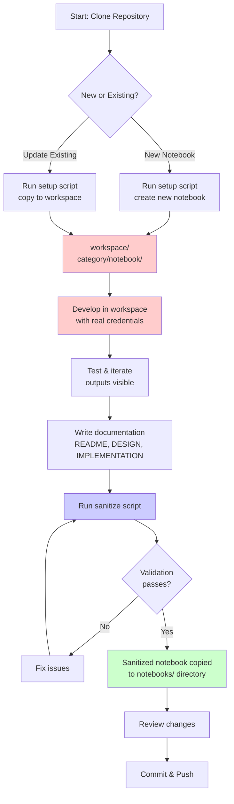
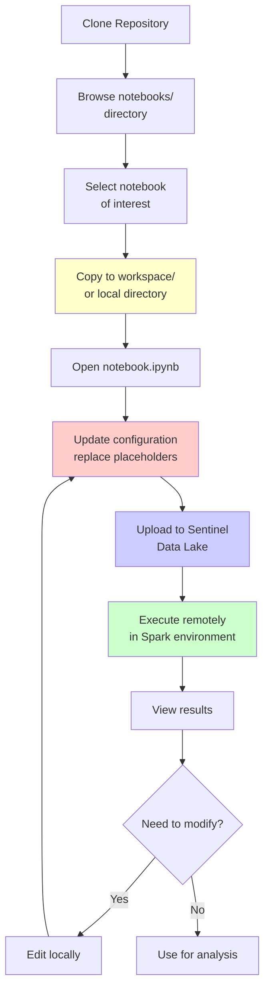
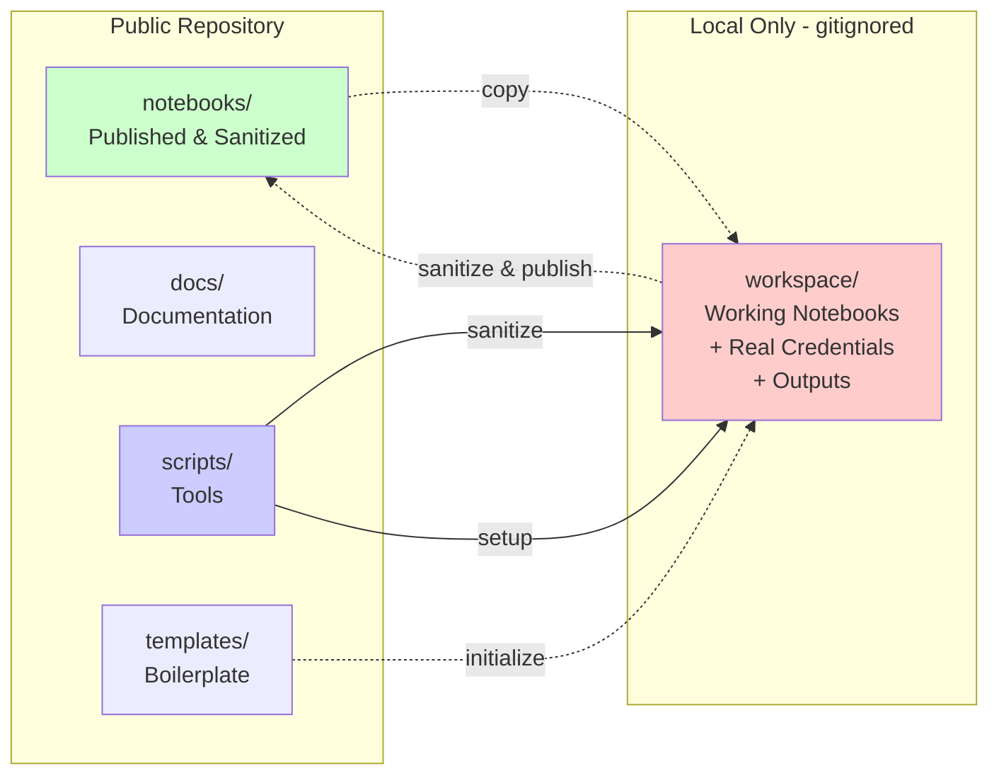
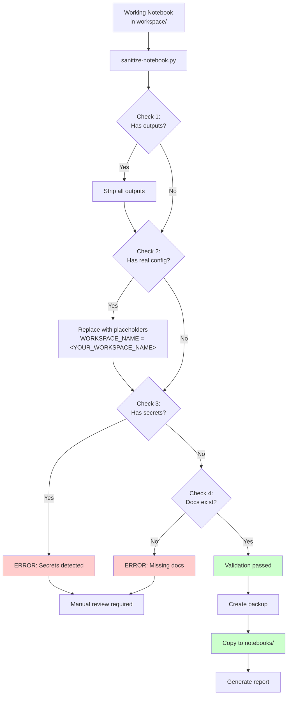
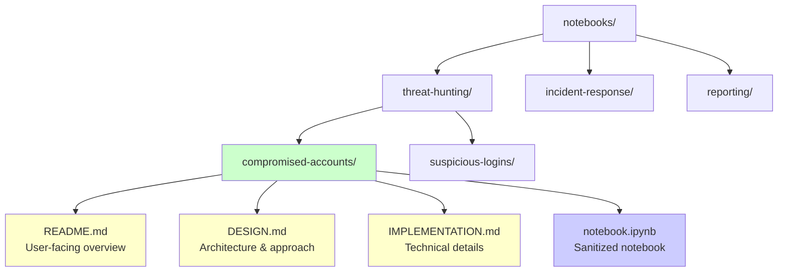

# Repository Workflow Diagram

## Contributor Workflow

```mermaid
graph TD
    A[Start: Clone Repository] --> B{New or Existing?}
    B -->|New Notebook| C[Run setup script<br/>create new notebook]
    B -->|Update Existing| D[Run setup script<br/>copy to workspace]
    
    C --> E[workspace/<br/>category/notebook/]
    D --> E
    
    E --> F[Develop in workspace<br/>with real credentials]
    F --> G[Test & iterate<br/>outputs visible]
    G --> H[Write documentation<br/>README, DESIGN, IMPLEMENTATION]
    
    H --> I[Run sanitize script]
    I --> J{Validation<br/>passes?}
    J -->|No| K[Fix issues]
    K --> I
    
    J -->|Yes| L[Sanitized notebook copied<br/>to notebooks/ directory]
    L --> M[Review changes]
    M --> N[Commit & Push]
    
    style E fill:#ffcccc
    style L fill:#ccffcc
    style F fill:#ffcccc
    style I fill:#ccccff
```

## End User Workflow

```mermaid
graph TD
    A[Clone Repository] --> B[Browse notebooks/<br/>directory]
    B --> C[Select notebook<br/>of interest]
    C --> D[Copy to workspace/<br/>or local directory]
    
    D --> E[Open notebook.ipynb]
    E --> F[Update configuration<br/>replace placeholders]
    F --> G[Upload to Sentinel<br/>Data Lake]
    G --> H[Execute remotely<br/>in Spark environment]
    H --> I[View results]
    
    I --> J{Need to modify?}
    J -->|Yes| K[Edit locally]
    K --> F
    J -->|No| L[Use for analysis]
    
    style D fill:#ffffcc
    style F fill:#ffcccc
    style G fill:#ccccff
    style H fill:#ccffcc
```

## Directory Separation Model

```mermaid
graph LR
    subgraph Public Repository
        A[notebooks/<br/>Published & Sanitized]
        B[docs/<br/>Documentation]
        C[scripts/<br/>Tools]
        D[templates/<br/>Boilerplate]
    end
    
    subgraph Local Only - gitignored
        E[workspace/<br/>Working Notebooks<br/>+ Real Credentials<br/>+ Outputs]
    end
    
    A -.copy.-> E
    E -.sanitize & publish.-> A
    D -.initialize.-> E
    C -->|sanitize| E
    C -->|setup| E
    
    style A fill:#ccffcc
    style E fill:#ffcccc
    style C fill:#ccccff
```

## Sanitization Process

```mermaid
graph TD
    A[Working Notebook<br/>in workspace/] --> B[sanitize-notebook.py]
    
    B --> C{Check 1:<br/>Has outputs?}
    C -->|Yes| D[Strip all outputs]
    C -->|No| E{Check 2:<br/>Has real config?}
    D --> E
    
    E -->|Yes| F[Replace with placeholders<br/>WORKSPACE_NAME = &lt;YOUR_WORKSPACE_NAME&gt;]
    E -->|No| G{Check 3:<br/>Has secrets?}
    F --> G
    
    G -->|Yes| H[ERROR: Secrets detected]
    G -->|No| I{Check 4:<br/>Docs exist?}
    
    I -->|No| J[ERROR: Missing docs]
    I -->|Yes| K[Validation passed]
    
    K --> L[Create backup]
    L --> M[Copy to notebooks/]
    M --> N[Generate report]
    
    H --> O[Manual review required]
    J --> O
    
    style H fill:#ffcccc
    style J fill:#ffcccc
    style K fill:#ccffcc
    style M fill:#ccffcc
```

## File Organization Pattern

```mermaid
graph TD
    A[notebooks/] --> B[threat-hunting/]
    A --> C[incident-response/]
    A --> D[reporting/]
    
    B --> E[compromised-accounts/]
    B --> F[suspicious-logins/]
    
    E --> G[README.md<br/>User-facing overview]
    E --> H[DESIGN.md<br/>Architecture & approach]
    E --> I[IMPLEMENTATION.md<br/>Technical details]
    E --> J[notebook.ipynb<br/>Sanitized notebook]
    
    style E fill:#ccffcc
    style G fill:#ffffcc
    style H fill:#ffffcc
    style I fill:#ffffcc
    style J fill:#ccccff
```
