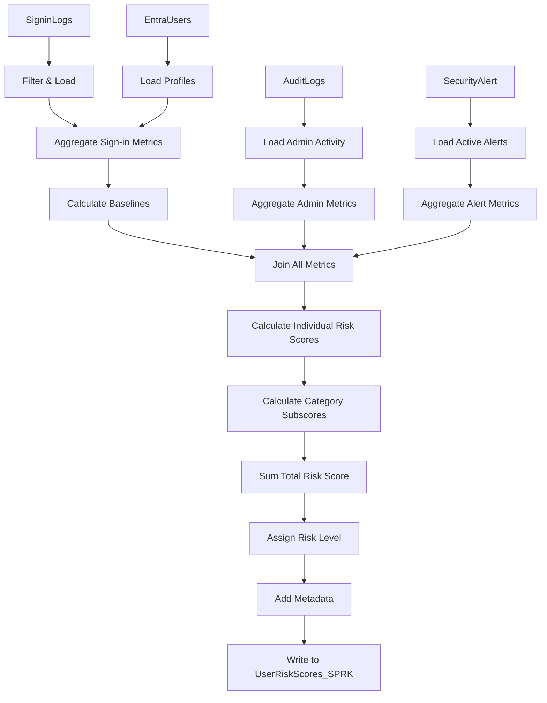

# User Risk Score - Complete Design Document

## Executive Summary

This notebook calculates a **100-point user risk score** for Microsoft Sentinel by analyzing user behavior across **4 data sources**: authentication patterns (SigninLogs), user profiles (EntraUsers), administrative activities (AuditLogs), and security incidents (SecurityAlert).

**Risk Categories:**
- **Sign-in Behavior (30 pts)** - IP diversity, device diversity, frequency anomalies
- **Application Access (25 pts)** - Unique apps and resources accessed  
- **Privileged Activity (20 pts)** - Admin operations and high-risk actions
- **Security Alerts (15 pts)** - Active alerts and severity
- **Geographic Risk (5 pts)** - Location-based indicators
- **Temporal Risk (5 pts)** - Off-hours activity patterns

**Risk Levels:** Low (0-30), Medium (31-60), High (61-100)

**Output:** Custom table `UserRiskScores_SPRK` with 27 fields for querying, workbooks, and analytics rules.

---

## Prompt history

Me: "Review this notebook and the references. Can you help me design a simple user risk score, using a few tables from the available data and some basic calculations?"

Roo: "What type of user risk score are you looking to calculate? This will help me design the right approach and select the most relevant data tables and metrics."

Me: "Comprehensive: Combining multiple factors from sign-ins, user attributes, and application access"

Roo: "I've designed a comprehensive user risk scoring system for your Sentinel data. Here's what I've created: plans/user_risk_score_design.md - Complete design specification. plans/user_risk_score_implementation.md - Ready-to-use code structure"

Me: "Great job. One additional thing, though. I want to demonstrate using data from multiple tables. Two tables is good, but 3-4 would be better. Are there some other tables we could get anything interesting from?"

Roo: "Based on the Sentinel data lake tables available, which additional tables would be most valuable for your risk scoring demonstration? Here are some good options that could add interesting security dimensions:"

Me: "Suggest the best tables based on common Sentinel deployments - I'll research typical available tables and propose 2-3 additional ones"

Roo: "Perfect! Based on common Sentinel deployments and the references in your notebook, I'll propose adding 2 additional tables that provide strong security value and demonstrate multi-table joins well"

---

## Table of Contents

1. [Overview](#overview)
2. [Data Sources](#data-sources)
3. [Risk Scoring Methodology](#risk-scoring-methodology)
4. [Implementation Architecture](#implementation-architecture)
5. [Output Schema](#output-schema)
6. [Use Cases](#use-cases)
7. [Configuration & Deployment](#configuration--deployment)

---

## Overview

### Purpose
Provide automated, quantitative user risk assessment for security operations teams to prioritize investigations, identify insider threats, and detect compromised accounts.

### Approach
Multi-dimensional risk scoring combining:
- **Behavioral analytics** (sign-in patterns, app usage)
- **Threat intelligence** (security alerts)
- **Privilege monitoring** (administrative actions)
- **Contextual baselines** (department comparisons)

### Key Features
- **Graceful degradation** - Works with 2-4 tables depending on availability
- **Department-aware baselines** - Context-sensitive frequency analysis
- **Weighted severity** - Security alerts get proportional impact
- **Production-ready** - Error handling, metadata tracking, configurable parameters

---

## Data Sources

### Required Tables (Always Available)

#### 1. SigninLogs
**Purpose:** User authentication and access patterns  
**Analysis Window:** Last 14 days (configurable)  
**Key Fields:**
- `UserId`, `UserPrincipalName`, `UserDisplayName`
- `IPAddress` - For IP diversity analysis
- `UserAgent` - For device diversity analysis
- `AppId`, `ResourceId` - For application access patterns
- `TimeGenerated` - For temporal analysis
- `Location` - For geographic patterns

**Filters Applied:**
- `UserType == "Member"` (exclude guests)
- `UserId IS NOT NULL`
- Last N days only

#### 2. EntraUsers  
**Purpose:** User profile and organizational context  
**Key Fields:**
- `id` - Unique user identifier (joins with UserId)
- `displayName`, `mail` - User identity
- `department` - For baseline calculations
- `country` - For geographic context
- `jobTitle` - For enrichment
- `accountEnabled` - Current status

**Usage:** Enriches sign-in data with organizational context for department baselines

### Optional Tables (Graceful Degradation)

#### 3. AuditLogs
**Purpose:** Administrative operations and privileged activities  
**Availability:** Requires Entra ID P1+ licensing  
**Key Fields:**
- `InitiatedBy.user.userPrincipalName` - Who performed action (JSON field)
- `OperationName` - Type of operation
- `Category` - Operation category
- `Result` - Success/failure
- `ActivityDateTime` - When it occurred

**High-Risk Operations Tracked:**
- Add/Remove member to role
- Delete user
- Update/Delete application
- Add owner to application  
- Update policy

**Fallback:** If unavailable, privileged activity score = 0

#### 4. SecurityAlert
**Purpose:** Active security incidents and detections  
**Availability:** Standard in all Sentinel workspaces  
**Key Fields:**
- `AlertName` - Type of alert
- `AlertSeverity` - High/Medium/Low/Informational
- `CompromisedEntity` - Affected user
- `Status` - New/InProgress/Resolved
- `TimeGenerated` - Alert timestamp
- `Tactics` - MITRE ATT&CK tactics

**Filters Applied:**
- `Status IN ("New", "InProgress")` - Only active alerts
- `CompromisedEntity IS NOT NULL`

**Fallback:** If unavailable, security alert score = 0

---

## Risk Scoring Methodology

### Category 1: Sign-in Behavior (30 points)

#### IP Address Risk (0-10 points)
**Metric:** Unique IP address count per user

| Unique IPs | Score | Rationale |
|------------|-------|-----------|
| 1-2 | 0 | Normal - single location or home+office |
| 3-5 | 3 | Moderate - possible travel or remote work |
| 6-10 | 7 | Elevated - unusual diversity |
| 11+ | 10 | High - potential credential sharing/compromise |

**Formula:**
```python
when(unique_ip_count <= 2, 0)
.when(unique_ip_count <= 5, 3)
.when(unique_ip_count <= 10, 7)
.otherwise(10)
```

#### Device Risk (0-10 points)
**Metric:** Unique user agent (device) count per user

| Unique Devices | Score | Rationale |
|----------------|-------|-----------|
| 1-2 | 0 | Normal - primary device + mobile |
| 3-4 | 3 | Moderate - multiple devices |
| 5-7 | 6 | Elevated - unusual diversity |
| 8+ | 10 | High - excessive device count |

#### Frequency Risk (0-10 points)
**Metric:** User's sign-in count vs. department baseline

| Frequency Ratio | Score | Rationale |
|-----------------|-------|-----------|
| < 1.0x | 0 | Below average - normal |
| 1-2x | 3 | Near average - normal |
| 2-3x | 6 | Above average - monitor |
| 3x+ | 10 | Significantly above - investigate |

**Baseline Calculation:**
```python
# Per-department average
dept_avg = signin_df.groupBy("department").agg(avg("total_signins"))

# Global fallback for users without department
global_avg = signin_df.agg(avg("total_signins"))

# User comparison
frequency_ratio = user_signins / baseline_signins
```

### Category 2: Application Access (25 points)

#### Application Risk (0-12 points)
**Metric:** Unique application (AppId) count

| Unique Apps | Score | Rationale |
|-------------|-------|-----------|
| 1-5 | 0 | Limited access - normal |
| 6-10 | 4 | Moderate access |
| 11-15 | 8 | Broad access |
| 16+ | 12 | Very broad access - large attack surface |

#### Resource Risk (0-13 points)
**Metric:** Unique resource (ResourceId) count

| Unique Resources | Score | Rationale |
|------------------|-------|-----------|
| 1-3 | 0 | Limited resources - normal |
| 4-6 | 4 | Moderate resource access |
| 7-10 | 8 | Broad resource access |
| 11+ | 13 | Very broad - potential over-privileged |

### Category 3: Privileged Activity (20 points)

**Note:** Only calculated if AuditLogs available

#### Admin Operations Risk (0-10 points)
**Metric:** Total administrative operation count

| Operations | Score | Rationale |
|------------|-------|-----------|
| 0 | 0 | No admin activity |
| 1-5 | 3 | Minimal admin operations |
| 6-15 | 7 | Moderate admin activity |
| 16+ | 10 | High admin activity - elevated risk |

#### High-Risk Operations (0-10 points)
**Metric:** Count of sensitive privileged operations

| High-Risk Ops | Score | Rationale |
|---------------|-------|-----------|
| 0 | 0 | No high-risk operations |
| 1-2 | 4 | Some sensitive operations |
| 3-5 | 7 | Multiple sensitive operations |
| 6+ | 10 | Frequent sensitive operations |

**High-Risk Operations List:**
- Add member to role
- Remove member from role
- Delete user
- Update application
- Add owner to application
- Update policy
- Delete application

### Category 4: Security Alerts (15 points)

**Note:** Only calculated if SecurityAlert available

#### Alert Count Score (0-8 points)
**Metric:** Number of active (unresolved) security alerts

| Active Alerts | Score | Rationale |
|---------------|-------|-----------|
| 0 | 0 | No active alerts |
| 1 | 3 | One active alert - investigate |
| 2-3 | 6 | Multiple alerts - priority |
| 4+ | 8 | Many alerts - immediate action |

#### Alert Severity Score (0-7 points)
**Metric:** Weighted sum of alert severities

**Severity Weights:**
- High = 4 points
- Medium = 2 points  
- Low = 1 point
- Informational = 0 points

| Weighted Severity | Score | Rationale |
|-------------------|-------|-----------|
| 0 | 0 | No alerts |
| 1-3 | 2 | Low severity alerts |
| 4-7 | 5 | Medium severity alerts |
| 8+ | 7 | High severity alerts |

### Category 5: Geographic Risk (5 points)

**Metric:** IP address diversity (proxy for geographic diversity)

| IP Diversity | Score | Rationale |
|--------------|-------|-----------|
| 1-3 IPs | 0 | Single location |
| 4-6 IPs | 2 | Multiple locations - normal |
| 7-10 IPs | 4 | Many locations - elevated |
| 11+ IPs | 5 | Excessive locations - suspicious |

**Note:** Simplified approach. Can be enhanced with IP geolocation for actual country-based analysis.

### Category 6: Temporal Risk (5 points)

**Metric:** Percentage of sign-ins outside business hours (6 AM - 6 PM)

| Off-Hours % | Score | Rationale |
|-------------|-------|-----------|
| 0-10% | 0 | Minimal off-hours - normal |
| 11-25% | 2 | Some off-hours - acceptable |
| 26-50% | 4 | Frequent off-hours - monitor |
| 51%+ | 5 | Majority off-hours - investigate |

**Business Hours:** Configurable (default 6 AM - 6 PM UTC)

---

## Implementation Architecture

### Data Flow Diagram



### Processing Steps

#### Step 1: Data Loading (Section 2)
- Load 4 tables with appropriate filters
- Filter SigninLogs: Member users, last N days, non-null UserId
- Filter AuditLogs: User-initiated only (not app-initiated)
- Filter SecurityAlert: Active alerts only (Status = New/InProgress)
- Handle missing tables with try/except blocks

#### Step 2: Sign-in Aggregation (Section 3)
```python
signin_metrics = (
    signin_df
    .groupBy("UserId", "UserPrincipalName", "UserDisplayName")
    .agg(
        countDistinct("IPAddress").alias("unique_ip_count"),
        countDistinct("UserAgent").alias("unique_device_count"),
        count("*").alias("total_signins"),
        countDistinct("AppId").alias("unique_app_count"),
        countDistinct("ResourceId").alias("unique_resource_count"),
        sum(when(hour("TimeGenerated") not in business_hours, 1).otherwise(0)).alias("offhours_signins")
    )
)
```

#### Step 3: Privileged Activity Aggregation (Section 4)
```python
if audit_available:
    audit_metrics = (
        audit_df
        .groupBy("UserPrincipalName")
        .agg(
            count("*").alias("total_admin_operations"),
            sum(when(col("OperationName").isin(high_risk_ops), 1)).alias("high_risk_operations")
        )
    )
else:
    # Empty DataFrame with correct schema
    audit_metrics = spark.createDataFrame([], schema)
```

#### Step 4: Security Alert Aggregation (Section 5)
```python
if alert_available:
    alert_metrics = (
        security_alert_df
        .groupBy("CompromisedEntity")
        .agg(
            count("*").alias("active_alert_count"),
            sum(severity_weights).alias("alert_severity_score")
        )
    )
else:
    alert_metrics = spark.createDataFrame([], schema)
```

#### Step 5: Join Strategy (Section 6)
**Primary:** SigninLogs (all users who signed in)  
**LEFT JOIN:** EntraUsers (for profiles)  
**LEFT JOIN:** AuditLogs metrics (nulls → 0)  
**LEFT JOIN:** SecurityAlert metrics (nulls → 0)

**Key:** Preserve all sign-in users, enrich with optional data

#### Step 6: Baseline Calculation (Section 7)
```python
# Department baselines
dept_baselines = combined_metrics.groupBy("department").agg(avg("total_signins"))

# Global fallback
global_avg = combined_metrics.agg(avg("total_signins"))

# Join and coalesce
combined_metrics = combined_metrics.join(dept_baselines, "department", "left")
    .withColumn("baseline_signins", coalesce(dept_baseline, lit(global_avg)))
```

#### Step 7: Risk Scoring (Sections 8-9)
- Calculate 9+ individual risk scores using `when().otherwise()` logic
- Sum into 6 category subscores
- Calculate total_risk_score (0-100)
- Assign risk_level (Low/Medium/High)
- Add has_active_alerts boolean flag

#### Step 8: Metadata & Output (Section 10)
- Add `calculation_date`, `analysis_start_date`, `analysis_end_date`, `TimeGenerated`
- Select 27 final output columns
- Order by `total_risk_score DESC`

#### Step 9: Write (Section 12)
```python
sentinel_provider.save_as_table(
    output_df,
    CUSTOM_TABLE_NAME,
    write_options={"mode": "overwrite", "mergeSchema": "true"}
)
```

---

## Output Schema

### Table: `UserRiskScores_SPRK`

| Field | Type | Category | Description |
|-------|------|----------|-------------|
| **Identity (6 fields)** |
| UserId | string | Identity | Unique user identifier |
| UserPrincipalName | string | Identity | User email/UPN |
| UserDisplayName | string | Identity | Display name |
| department | string | Identity | User's department |
| country | string | Identity | User's country |
| jobTitle | string | Identity | Job title |
| **Risk Scores (8 fields)** |
| total_risk_score | int | Score | Overall risk (0-100) |
| risk_level | string | Score | Low/Medium/High |
| signin_behavior_score | int | Score | Sign-in subscore (0-30) |
| application_access_score | int | Score | App access subscore (0-25) |
| privileged_activity_score | int | Score | Admin subscore (0-20) |
| security_alert_score | int | Score | Alert subscore (0-15) |
| geographic_risk_score | int | Score | Geographic subscore (0-5) |
| temporal_risk_score | int | Score | Temporal subscore (0-5) |
| **Sign-in Metrics (6 fields)** |
| unique_ip_count | int | Metric | Distinct IP addresses |
| unique_device_count | int | Metric | Distinct devices |
| total_signins | int | Metric | Total sign-in events |
| unique_app_count | int | Metric | Distinct applications |
| unique_resource_count | int | Metric | Distinct resources |
| offhours_signin_percent | float | Metric | % off-hours activity |
| **Admin Metrics (2 fields)** |
| total_admin_operations | int | Metric | Count of admin operations |
| high_risk_operations | int | Metric | Count of sensitive ops |
| **Alert Metrics (3 fields)** |
| active_alert_count | int | Metric | Number of active alerts |
| alert_severity_score | int | Metric | Weighted severity |
| has_active_alerts | boolean | Metric | True if any alerts |
| **Metadata (4 fields)** |
| calculation_date | timestamp | Meta | When calculated |
| analysis_start_date | timestamp | Meta | Window start |
| analysis_end_date | timestamp | Meta | Window end |
| TimeGenerated | timestamp | Meta | Record creation |

**Total:** 27 columns

---

## Use Cases

### 1. Insider Threat Detection
**Scenario:** User with legitimate access showing suspicious patterns

**Risk Profile:**
- High admin activity (15 pts) - Many privileged operations
- Multiple security alerts (10 pts) - Suspicious behavior detected  
- Unusual access patterns (20 pts) - Different IPs, off-hours
- **Total: 45+ = Medium-High Risk**

**Action:** Investigate for policy violations, data exfiltration attempts

### 2. Compromised Account
**Scenario:** External attacker using stolen credentials

**Risk Profile:**
- Multiple high-severity alerts (15 pts) - Threat detection fired
- Geographic anomalies (5 pts) - Access from unexpected locations
- Unusual sign-in frequency (10 pts) - Automated access attempts
- **Total: 30+ = Medium Risk → Trigger investigation**

**Action:** Force password reset, review access logs, check for data theft

### 3. Privileged User Monitoring
**Scenario:** IT admin with broad access performing regular duties

**Risk Profile:**
- High-risk operations (10 pts) - Role assignments, policy changes
- Many admin operations (10 pts) - Regular administrative work
- Broad application access (20 pts) - Many systems managed
- **Total: 40+ = Monitor closely**

**Action:** Regular audit reviews, ensure actions align with tickets

### 4. Overprivileged Account
**Scenario:** User with excessive permissions relative to role

**Risk Profile:**
- Very broad app access (12 pts) - 16+ applications
- Very broad resource access (13 pts) - 11+ resources
- Frequency above baseline (6 pts) - Heavy usage
- **Total: 31+ = Medium Risk**

**Action:** Permission review, principle of least privilege enforcement

### 5. Remote Worker (Low Risk)
**Scenario:** Legitimate user working from multiple locations

**Risk Profile:**
- Multiple IPs (3 pts) - Home + travel
- Multiple devices (3 pts) - Laptop + mobile
- No alerts (0 pts) - Clean security record
- Normal timing (0 pts) - Business hours access
- **Total: 6 = Low Risk**

**Action:** No immediate action, continue monitoring

---

## Configuration & Deployment

### Configuration Parameters

```python
# Required
WORKSPACE_NAME = "YourWorkspaceName"  # Set via Spark config or variable

# Optional (with defaults)
ANALYSIS_DAYS = 14                    # Analysis window
MIN_SIGNIN_THRESHOLD = 3              # Minimum events per user
BUSINESS_HOUR_START = 6               # Business hours start (24h)
BUSINESS_HOUR_END = 18                # Business hours end (24h)
```

### Configuration Methods

#### 1. Development (VS Code)
Add cell before Section 1:
```python
WORKSPACE_NAME = 'YourWorkspaceName'
```

#### 2. Spark Configuration
In Section 1:
```python
spark.conf.set('spark.sentinel.workspace.name', 'YourWorkspaceName')
spark.conf.set('spark.sentinel.analysis.days', '14')
```

#### 3. Notebook Parameters (Production)
When scheduling in Synapse/Sentinel:
```json
{
  "spark.sentinel.workspace.name": "YourWorkspaceName",
  "spark.sentinel.analysis.days": "14"
}
```

### Required Permissions

**To Run:**
- Microsoft Sentinel Reader
- Synapse Spark User

**To Write Results:**
- Microsoft Sentinel Contributor, OR
- Storage Blob Data Contributor

### Performance Optimization

```python
# Cache large DataFrames
signin_df.cache()
combined_metrics.cache()

# Filter early
signin_df = signin_df.filter(
    (col("UserType") == "Member") &
    (col("TimeGenerated") >= analysis_start)
)

# Repartition for parallelism
signin_df = signin_df.repartition(200, "UserId")

# Cleanup when done
signin_df.unpersist()
```

### Scheduling

**Recommended Frequency:** Daily or weekly

**Execution Time:** ~5-15 minutes depending on data volume

**Storage:** Overwrite mode replaces previous scores with current analysis

### Extensibility

**Easy Additions:**
- Failed sign-in attempts (requires additional filtering)
- Peer group comparisons (similar job titles)
- Historical trending (append mode with date partitions)
- Threat intelligence enrichment (IP reputation scores)
- Custom alert rules based on risk score thresholds

---

## Summary

This user risk scoring system provides a **comprehensive, automated approach** to identifying high-risk users in Microsoft Sentinel environments. By combining behavioral analytics, threat intelligence, privilege monitoring, and contextual baselines, security teams can:

✅ **Prioritize investigations** based on quantitative risk scores  
✅ **Detect insider threats** through privilege and behavior analysis  
✅ **Identify compromised accounts** via alert correlation and anomalies  
✅ **Monitor privileged users** with administrative activity tracking  
✅ **Reduce alert fatigue** by focusing on high-risk entities  

The modular design with graceful degradation ensures the notebook works across different Sentinel environments, while the extensible architecture allows for easy enhancement as new data sources become available.